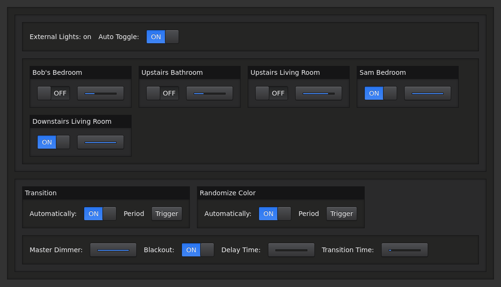

# Synesthesia Project Light Desk

`light-desk` is a library for creating virtual control panels for controlling
lighting and other things. These control panels are designed to work well with
both touch-screen devices and mouse cursors alike.

You simply install and use the node module in your Node.js project, and then
visit a specific URL from your web browser to access and use the control panel
while your project is running.

The project is open source, and the source code is available [on GitHub](https://github.com/synesthesia-project/light-desk).



## Installation

You can install this library from NPM:

```
$ npm install @synesthesia-project/light-desk
```

or

```
$ yarn add @synesthesia-project/light-desk
```

Alternatively, you can add this repository as a submodule to your repo, and add
a symlink from `node_modules/@synesthesia-project/light-desk` to the location of
that submodule within your repo to use in-development versions, and if you want
to contribute, such as what's done in the [synesthesia-project/synesthesia](https://github.com/synesthesia-project/synesthesia)
repo.

## Usage

Virtual desks are constructed from
[individual components](https://synesthesia-project.github.io/light-desk/api/)
that you collect together in
[groups](https://synesthesia-project.github.io/light-desk/api/classes/_components_group_.group.html)
to distribute them over your desk. Groups arrange their components either
vertically or horizontally, and can contain sub-groups.

Light desks must have a `"root"` group, which components are then added to to
build up the layout of desks.

```js
const lightDesk = require('@synesthesia-project/light-desk');

const desk = new lightDesk.LightDesk();
const group = new lightDesk.Group();
desk.setRoot(group);
```

### Usage with Typescript

If you use typescript for your project, types for this module when you import should work automatically. There is no need to install a specific `@types/X` package etc... as they are included in the `@synesthesia-project/light-desk` package (`light-desk` is itself also written in TypeScript, and so the type declarations are generated automatically).

```ts
import {LightDesk} from '@synesthesia-project/light-desk';

const desk = new LightDesk();
// ..
```

## Examples

See the [examples](https://github.com/synesthesia-project/light-desk/tree/master/examples) directory for full examples.

### [Hello World Example](https://github.com/synesthesia-project/light-desk/tree/master/examples/hello-world)

```js
const lightDesk = require('@synesthesia-project/light-desk');

function buttonPressed() {
  console.log("The button was pressed!");
}

const desk = new lightDesk.LightDesk();

// Create the root "group" for your desk, which new components can be added to
const group = new lightDesk.Group();
desk.setRoot(group);

// Create a button that calls buttonPressed(),
const button = new lightDesk.Button("Hello World");
group.addChild(button);
button.addListener(buttonPressed);
```

Upon running this code, a URL will be printed to stdout which can be visited from a web browser to view the control panel, e.g:

```
$ node index.js
Starting light desk on port: 1337
Light Desk Started: http://localhost:1337
```

### [Light Beat Example](https://github.com/synesthesia-project/light-desk/tree/master/examples/light-beat)

A basic example TypeScript project that uses `light-desk` to control a virtual "flashing light".
It should be pretty simple to extend this project to actually control the brightness of a real
light, e.g. some light strip controlled by a raspberry pi, or some DMX fixture.

<iframe width="560" height="315" src="https://www.youtube.com/embed/d5p26aAb-hQ" frameborder="0" allow="accelerometer; autoplay; encrypted-media; gyroscope; picture-in-picture" allowfullscreen></iframe>

## [Api Reference](https://synesthesia-project.github.io/light-desk/api/)

All of the different components you can use within a light desk are documented
in the [Api Reference](https://synesthesia-project.github.io/light-desk/api/).

