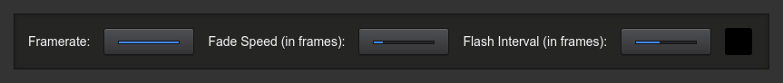

## light-beat

A basic example TypeScript project that uses `light-desk` to control a virtual "flashing light".
It should be pretty simple to extend this project to actually control the brightness of a real
light, e.g. some light strip controlled by a raspberry pi, or some DMX fixture.

A demo video of this example project in action can be found here: https://youtu.be/d5p26aAb-hQ